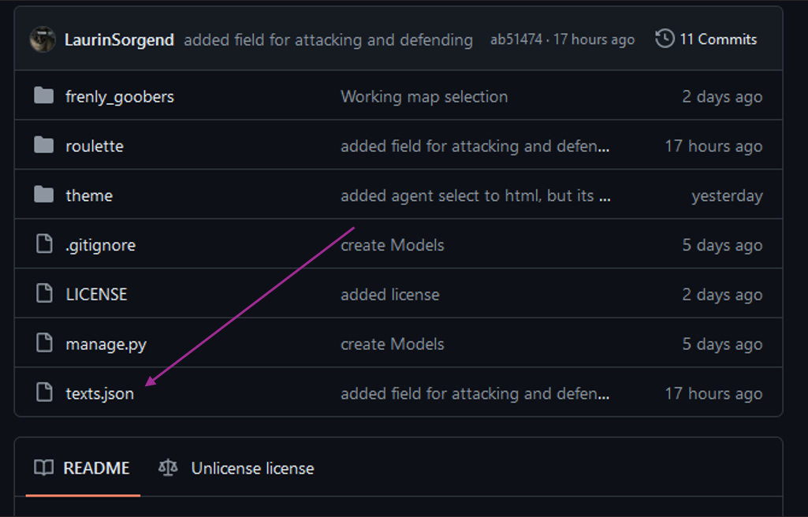
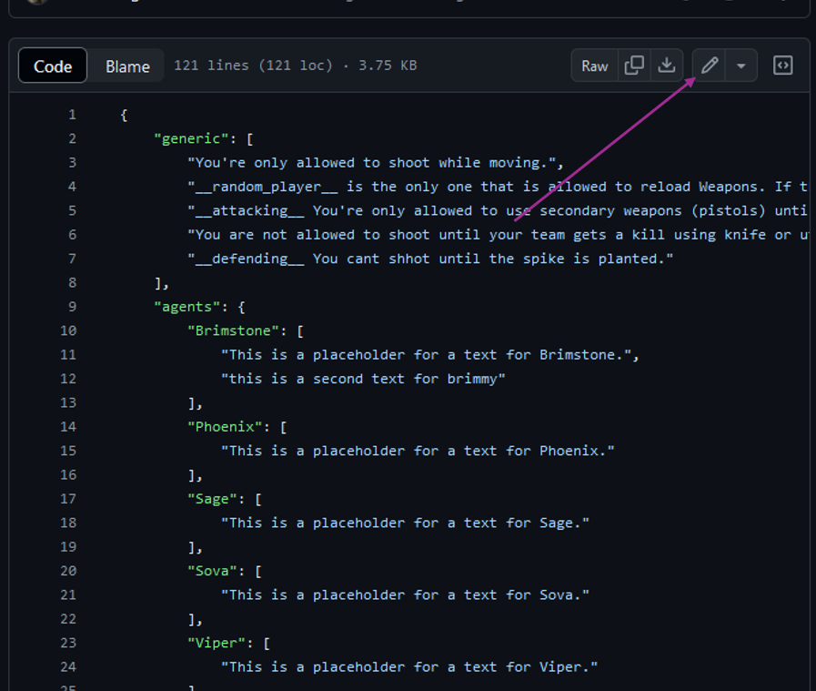

If you have an Idea for a Good Strat this is how you do it.

You'll need a [GitHub account](https://github.com/join)!

1. Access this [GitHub page](https://github.com/LaurinSorgend/frenly-goobers)
2. Click on the `texts.json` file: 
3. Now Click on the edit icon. 
4. You can now start editing the json using the in-browser editor.
    - If you edit/add a text in the agents or maps section it will only show up if that Agent or Map is selected.
    - If the text starts with `__attacking__` or `__defending__` it will only show up if Attacking or Defending is selected.
    - If you have `__random_player__` in the text it will be replaced by a Random agent if one is selected or `A random player`.
5. Say what you edited (and why) and the click on "Propose file change".
6. Submit the [pull request](https://help.github.com/articles/using-pull-requests/)!